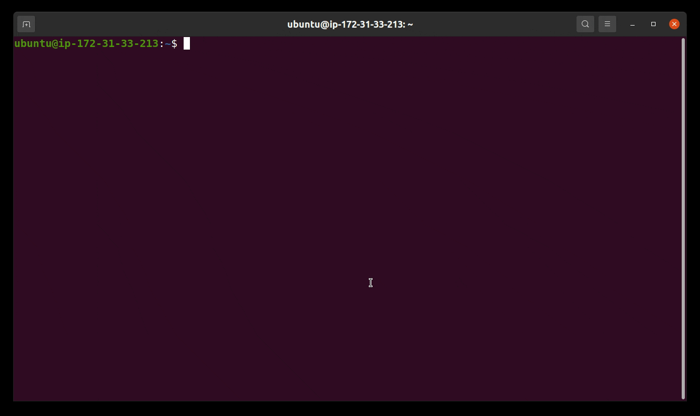
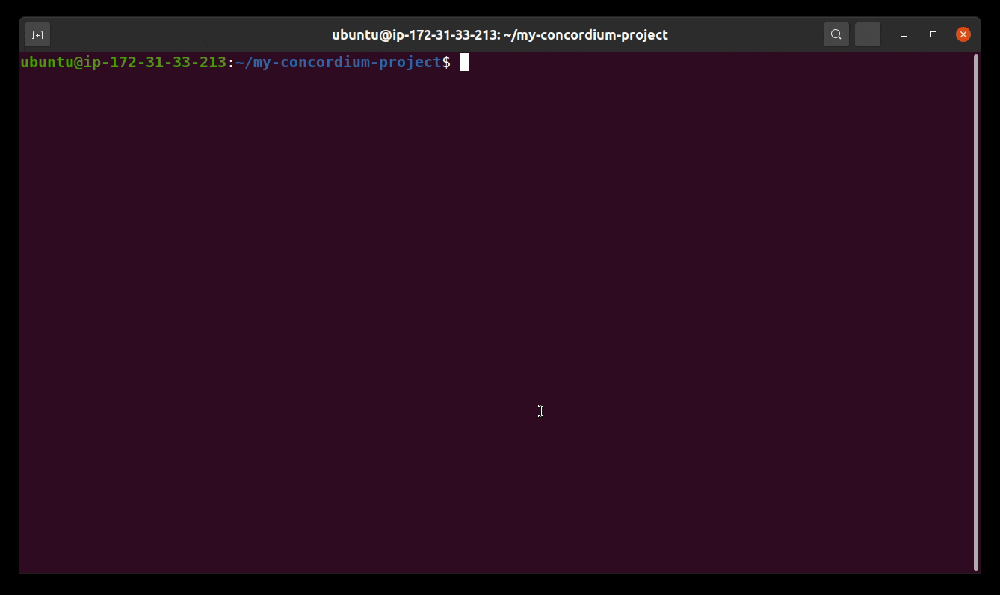
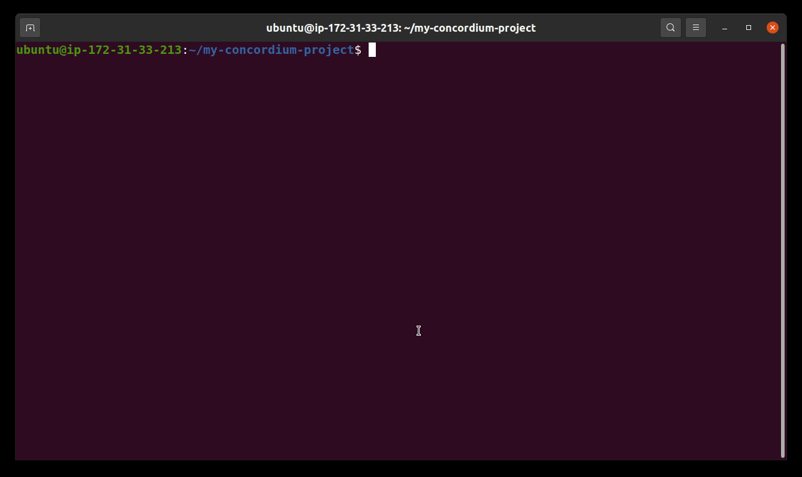

# Concordium Smart Contract Templates

This repo helps you to get a new Concordium smart contract project up and running quickly by leveraging the pre-existing templates in this git repository. There are several smart contract templates available in this repository (currently a `default` template and a `cis2-nft` template). For generating the smart contracts from the templates, the `cargo-generate` crate is required. `Cargo-generate` can be installed by running the following command:

```
cargo install --locked cargo-generate
```

You also need the `cargo-concordium` crate if you want to test and compile your newly generated Concordium project. `Cargo-concordium` can be installed as described in the following guide:

[Cargo-concordium setup](https://developer.concordium.software/en/mainnet/smart-contracts/guides/setup-tools.html#setup-tools)

Here is an example of using the templates: 

## Examples

### Generationg a new project



To start a new Concordium smart contract project from a template, run the command:

```
cargo concordium init
```

The path where the project should be created can be provided with the --path option.

### Compiling the new project



### Testing the new project



### Deploying the new project on chain

## The `default` Template

## The `cis2-nft` Template

## Additional Documentation

[Developer documentation](https://developer.concordium.software/en/mainnet/smart-contracts/guides/setup-contract.html#from-a-template)
