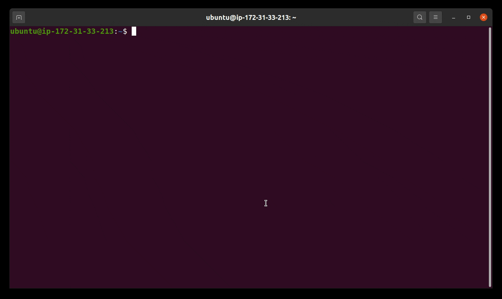
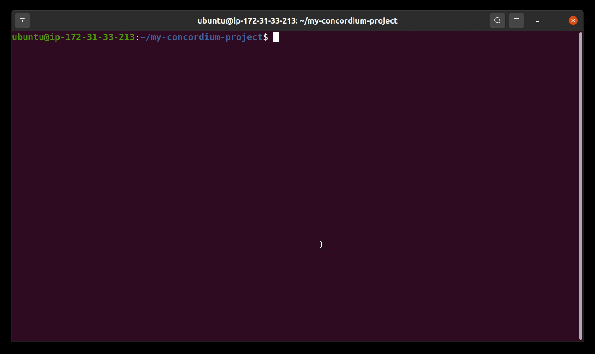
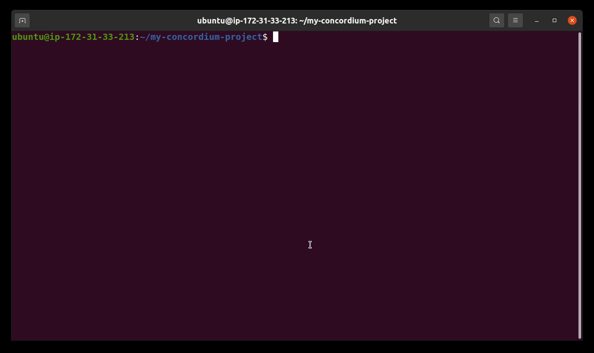
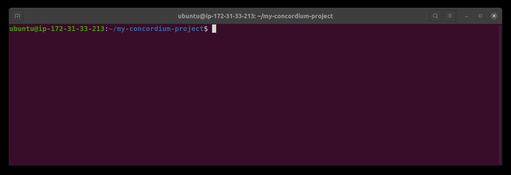
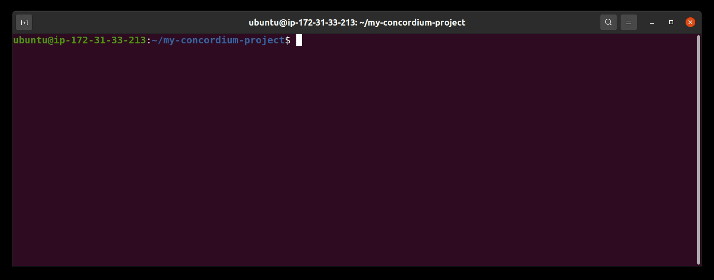
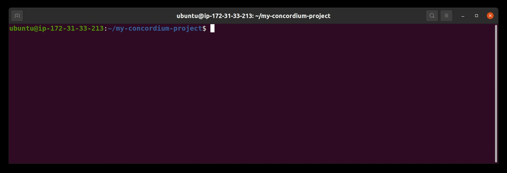

# Concordium Smart Contract Templates

This repository helps you to get a new Concordium smart contract project up and running quickly by leveraging the pre-existing templates in it. There are several smart contract templates available in this repository (currently a `default` template and a `cis2-nft` template). For generating the smart contracts from the templates, you need the `cargo-concordium` tool version 2.4.0 or greater. `Cargo-concordium` can be installed as described in the following guide:

[Cargo-concordium setup](https://developer.concordium.software/en/mainnet/smart-contracts/guides/setup-tools.html#setup-tools)

You also need the `cargo-generate` tool (recommended version 0.16.0 or greater). `Cargo-generate` can be installed by running the following command:

```
cargo install --locked cargo-generate
```

Here are some examples of using the templates:

## Examples

### Generating a new project



To start a new Concordium smart contract project from a template, run the command:

```
cargo concordium init
```

The path where the project should be created can be provided with the ``--path`` option.

### Compiling the new project



To compile your newly generated Concordium smart contract project, run the command:

```
cargo concordium build -e --out ./my_concordium_project.wasm.v1
```

This command will compile your new smart contract project and generate a smart contract module file named ``my_concordium_project.wasm.v1``. The ``--out`` option outputs this smart contract module file into your project root folder.
The ``-e`` flag embeds the smart contract schema into your smart contract module. You can read more about smart contract schemas [here](https://developer.concordium.software/en/mainnet/smart-contracts/guides/build-schema.html).

### Testing the new project



To run the unit tests included in your newly generated Concordium smart contract project, run the command:

```
cargo concordium test
```

## The `default` Template

This template generates some smart contract boilerplate code. The boilerplate code has an example ``State`` struct and three functions (`init`, `receive`, and `view`).
- The `init` function is used to deploy and initialize your module on-chain. It has an example custom input parameter.
- The `view` function returns the state of the smart contract.
- The `receive` function can be invoked with the boolean parameter ``return_error``. If the function is invoked with `return_error == true`, the receive function will return a custom error. If the function is invoked with `return_error == false`, the receive function executes successfully. You can customize the logic of the ``receive`` function as you see fit.

### Simulating the deployment of the module



```
cargo concordium run init --module ./my_concordium_project.wasm.v1 --contract my_concordium_project --context contextInit.json --out-bin state.bin --parameter-json input.json
```

This command simulates the deployment of your smart contract module. You need a ``contextInit.json`` file and a ``input.json`` file. The ``contextInit.json`` file should look like this:

```
{
    "metadata": {
        "slotTime": "2021-01-01T00:00:01Z"
    },
    "initOrigin": "4phD1qaS3U1nLrzJcgYyiPq1k8aV1wAjTjYVPE3JaqovViXS4j",
    "senderPolicies": [{
        "identityProvider": 1,
        "createdAt": "202012",
        "validTo": "202109"
    }]
}
```

The ``input.json`` file should look like this:

```
{
    "num": 42
}
```

### Simulating the view function



```
cargo concordium run update --entrypoint view --module ./my_concordium_project.wasm.v1 --state-bin state.bin --contract my_concordium_project --context contextUpdate.json
```

This command simulates an invoke to the ``view`` function of your smart contract module. You require a ``contextUpdate.json`` file similar to the following one:

```
{
    "metadata": {
        "slotTime": "2026-01-01T00:00:01Z"
    },
    "invoker": "3uxeCZwa3SxbksPWHwXWxCsaPucZdzNaXsRbkztqUUYRo1MnvF",
    "selfAddress": {"index": 0, "subindex": 0},
    "selfBalance": "0",
    "sender": {
        "type": "account",
        "address": "3uxeCZwa3SxbksPWHwXWxCsaPucZdzNaXsRbkztqUUYRo1MnvF"
    },
    "senderPolicies": [{
        "identityProvider": 1,
        "createdAt": "202012",
        "validTo": "202109"
    }],
    "owner": "3uxeCZwa3SxbksPWHwXWxCsaPucZdzNaXsRbkztqUUYRo1MnvF"
}
```

### Simulating the receive function with the input parameter `return_error == false`



```
cargo concordium run update --entrypoint receive --module ./my_concordium_project.wasm.v1 --parameter-json returnErrorFalse.json --state-bin state.bin --contract my_concordium_project --context contextUpdate.json
```

Where the contents of ``returnErrorFalse.json`` is simply `false`.

This command simulates an invoke to the ``receive`` function of your smart contract module with the input parameter `return_error == false`.

### Simulating the receive function with the input parameter `return_error == true`


```
cargo concordium run update --entrypoint receive --module ./my_concordium_project.wasm.v1 --parameter-json returnErrorTrue.json --state-bin state.bin --contract my_concordium_project --context contextUpdate.json
```

Where the contents of ``returnErrorTrue.json`` is simply ``true``.

This command simulates an invoke to the ``receive`` function of your smart contract module with the input parameter `return_error == true`.

## The `cis2-nft` Template

This template generates an NFT token smart contract. The token follows the Concordium [CIS2 token standard](https://proposals.concordium.software/CIS/cis-2.html). To get more familiar with how to interact with a CIS2 token, you can read the
[wCCD tutorial](https://developer.concordium.software/en/mainnet/smart-contracts/tutorials/wCCD/wCCD-interacting.html).

## Additional Documentation

[Developer documentation](https://developer.concordium.software/en/mainnet/smart-contracts/guides/setup-contract.html#from-a-template)
